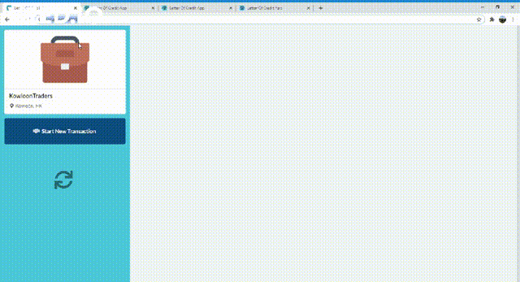
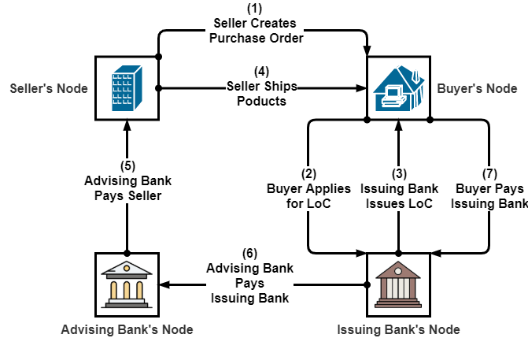
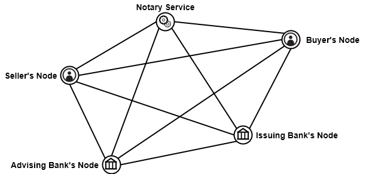

# Letter of Credit on Blockchain



The letter of credit on blockchain platform is used to create, issue and manage Letter of
Credit, Purchase Order and Bill of Lading in a secure and distributed manner.



The core functionalities of this application are:
* Create Purchase Order
* Create & Issue Letter of Credit
* Manage States in Letter of Credit
* Create & Issue Bill of Lading
* Handle Ownership Management of the Bill of Lading

This project addresses the need for a secure digital platform to create and manage
trade documents without intervention from other 3rd party organizations.

## Network Overview


## Technologies Used

The following technologies are used to develop the application -
* **[Corda](https://www.corda.net/)**: ​Used to build the blockchain network & complete transaction.
* **[Spring Boot](https://spring.io/projects/spring-boot)**: The backend of the web application is built in Spring Boot on JVM.
It connects with Node using RPC Client API. The transactions are also written in
Java.
* **[ReactJS](https://reactjs.org/)**: ​The frontend web application is developed with ReactJS. Semantic-UI
was used for styling.

## User Analysis

The users of the platform include - Exporter(Seller), Importer(Buyer), Advising Bank, Issuing Bank. 

The actions that can be performed by each party are as follows -

* **Exporter/Seller:** ​Creates Purchase Order
* **Importer/Buyer:** ​Applies for Letter of Credit to Issuing Bank
* **Issuing Bank:** ​Issues Letter of Credit or Rejects Letter of Credit Application
* **Exporter/Seller:** ​After issuance of the letter of credit, the seller ships the product and
creates Bill of Lading. The current owner of the products is still the seller.
* **Advising Bank:** ​After the shipment, the advising bank pays the seller. The ownership is
transferred to the Advising Bank.
* **Issuing Bank:** ​Then, the Issuing Bank pays the Advising Bank. The ownership is
transferred to the Issuing Bank.
* **Importer/Buyer:** ​Lastly, the Buyer pays the Advising Bank. The ownership is finally
transferred to the Buyer.

## Getting Started

### Prerequisites

In order to run the application, please make sure you have Java 8 installed. (Corda requires at least version 8u171, but do not currently support Java 9 or higher for Corda 4.5)

### Starting Corda Network

1) Clone the repository
    ```sh
    https://github.com/KAIMonmoy/Corda-Letter-of-Credit
    ```
2) Build nodes with letter of credit cordapp installed
* Windows: 
    ```sh
    .\gradlew.bat deployNodes
    ```
* Unix/Mac OSX: 
  ```sh
    ./gradlew deployNodes
  ```
3) Start the corda test network
* Windows: 
    ```sh
    .\workflows-java\build\nodes\runnodes.bat
    ```
* Unix/Mac OSX: 
  ```sh
    ./workflows-java/build/nodes/runnodes
  ```

### Starting Web Application

Start a Spring Boot server for each node by opening a terminal/command prompt for each node and entering the following command, replacing X with A, B, C and D:
* Windows: 
    ```sh
    .\gradlew.bat runPartyXServer
    ```
* Unix/Mac OSX: 
  ```sh
    ./gradlew runPartyXServer
  ```
Look for the Started Server in X seconds message — don’t rely on the % indicator.

In your browser, navigate open:

* **[Kowloon Traders App](http://localhost:50005/):** http://localhost:50005
* **[Chittagong Traders App](http://localhost:50006/):** http://localhost:50006
* **[Dhaka Bank App](http://localhost:50007/):** http://localhost:50007
* **[Kowloon Bank App](http://localhost:50008/):** http://localhost:50008

## Contact

Khandker Aftarul Islam (Monmoy) - [aftarulislam@gmail.com](mailto:aftarulislam@gmail.com) 

Project Link: [https://github.com/KAIMonmoy/Corda-Letter-of-Credit](https://github.com/KAIMonmoy/Corda-Letter-of-Credit)

#### Thanks to **[Tasin Ishmam](https://tasinishmam.com/)** for suggesting this awesome readme format!